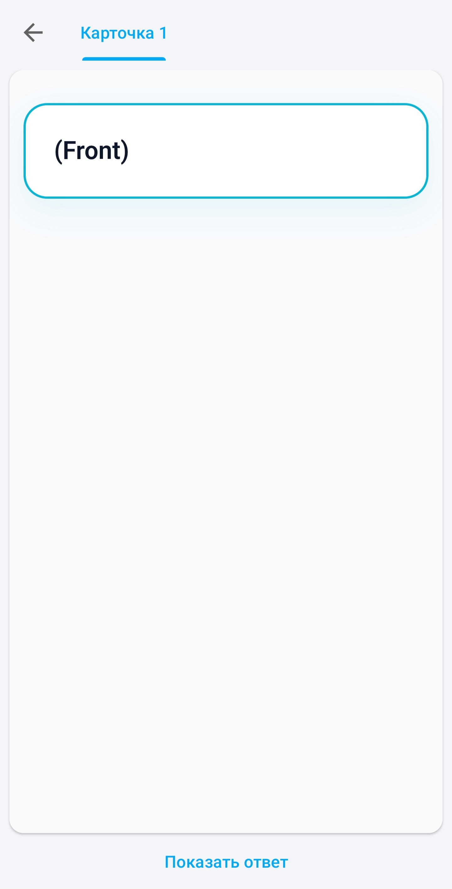
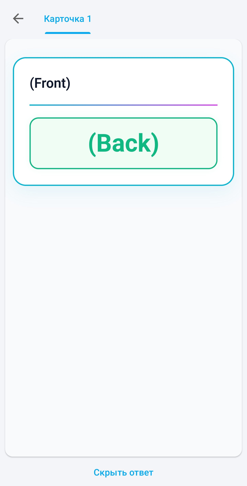

# ⚡️ AnkiDroid Neon Light Theme

> **A clean, minimalist white theme for Anki and AnkiDroid with vibrant neon accents and smart responsive text sizing.**  
> Легкая минималистичная светлая тема для Anki и AnkiDroid с яркими неоновыми акцентами и умной адаптацией размера шрифта.

[](https://apps.ankiweb.net/)
[](https://github.com/ankidroid/Anki-Android)
[](#)

---

## ✨ Особенности / Features

* 🤍 **Кибер-минимализм:** Идеально белый фон карточек, который не перегружает интерфейс и помогает сфокусироваться.
* ⚡️ **Неоновые акценты:** Яркие бирюзовые, пурпурные и зеленые маркеры для мгновенного визуального разделения элементов.
* 📏 **Умный размер ответа (JS Auto-scale):** Шрифт автоматически уменьшается, если ответ длинный, чтобы он гарантированно помещался в неоновую рамку на любом экране.
* 📐 **MathJax & LaTeX:** Математические формулы и выражения аккуратно подсвечиваются мягким неоново-пурпурным цветом.
* 📱 **Адаптивность:** Полная отзывчивость — отлично смотрится как на экранах мобильных телефонов, так и в десктопной версии.

---

## 📸 Скриншоты / Screenshots

| Передняя сторона (Front) | Обратная сторона (Back) |
| :---: | :---: |
|  |  |

---

## 🚀 Установка / How to Install

### Шаг 1. Настройка стилей (CSS)
1. Откройте **Anki** на компьютере или **AnkiDroid** на телефоне.
2. Перейдите в меню управления типами записей (**Manage Note Types**) -> выберите свой тип карты -> нажмите кнопку **Карты (Cards)**.
3. Скопируйте весь код из файла `Style_AnkiDroid.css`[cite: 2] и вставьте его в поле **Стили (Styling)**.

### Шаг 2. Настройка шаблонов (HTML)
* **Передняя сторона:** Скопируйте код из файла `Front_AnkiDroid.html`[cite: 3] и вставьте его в поле **Шаблон передней стороны (Front Template)**.
* **Обратная сторона:** Скопируйте код из файла `Back_AnkiDroid.html`[cite: 1] и вставьте его в поле **Шаблон обратной стороны (Back Template)**.

---

## 🛠️ Кастомизация / Customization

Вы можете легко изменить три главных неоновых цвета под себя. Для этого отредактируйте переменные в самом верху файла `Style_AnkiDroid.css`[cite: 2]:

```css
:root {
  --neon-cyan: #06b6d4;    /* Цвет рамки карточки */
  --neon-purple: #d946ef;  /* Цвет формул в вопросе */
  --neon-green: #10b981;   /* Цвет правильного ответа */
}
